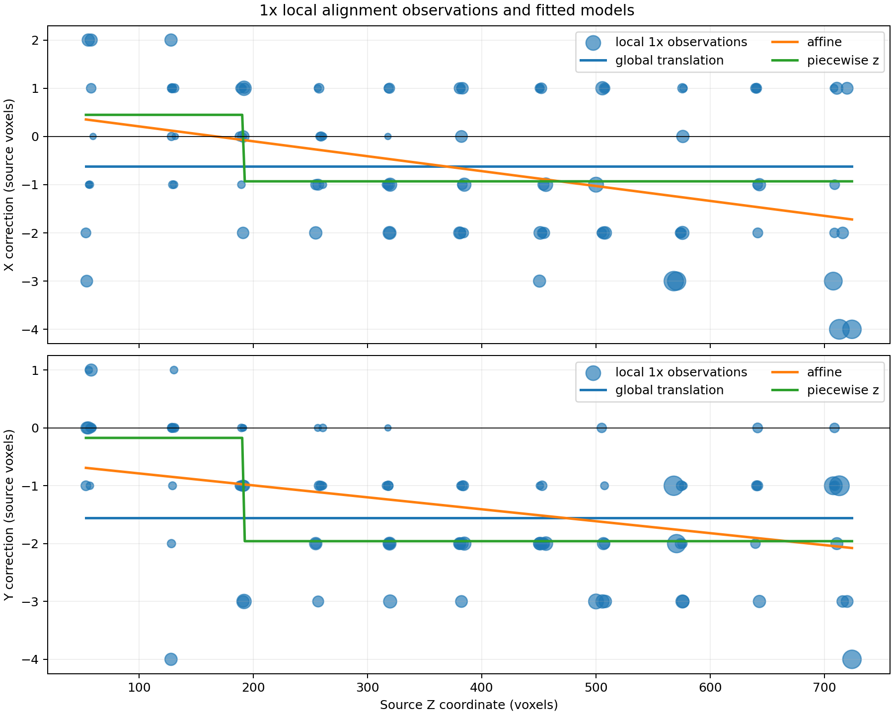
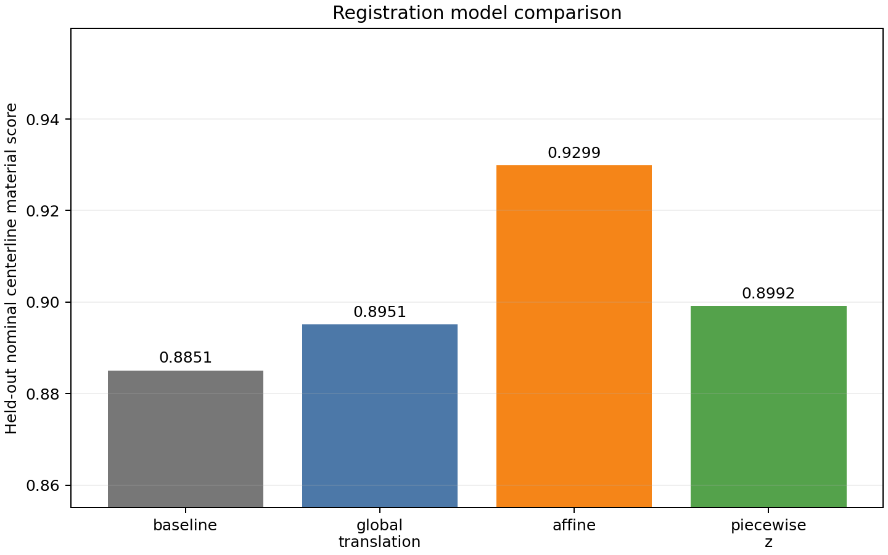
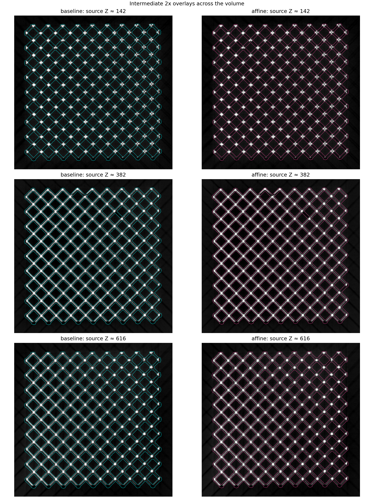
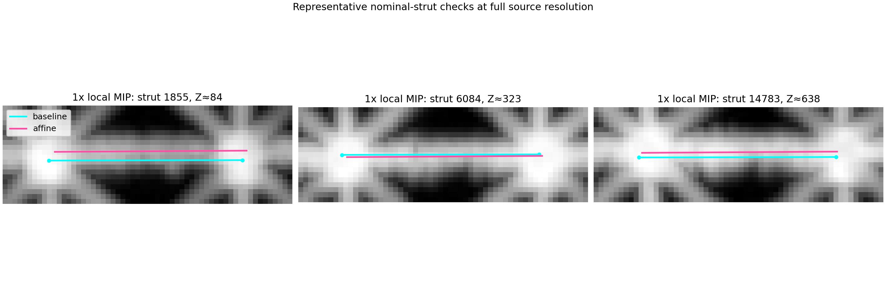
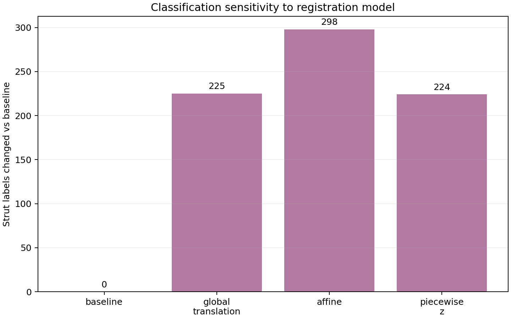

# Registration Alignment Check

## Outcome

The alignment was refined with full-resolution (1x) centerline samples from
4,441 high-occupancy nominal control struts. Whole-volume overlays
remain at 2x to bound memory. The best held-out model was **affine**,
with a material-support gain of **+0.04483** over the unmodified registration.

Validate the affine model on manually reviewed struts before promoting the separate candidate JSON.

## Method

- The source TIFF remained a read-only memmap.
- Controls were nominal struts in the upper occupancy quartile
  (`ct_material_occupancy >= 0.3306`).
- Controls were split deterministically into training and held-out sets by strut ID.
- Local XY corrections were searched at integer 1x resolution from
  `-4` to `+4` source voxels.
- Four models were compared: baseline, global XY translation, affine XY displacement
  as a function of X/Y/Z, and a two-block piecewise-Z translation.
- All four models were then passed through the Stage 2a tube sampler to measure
  classification sensitivity, using the recorded execution parameters
  (6-voxel tube, threshold 40081, empty-station fraction 0.05, and fixed
  expected-supported cutoff 0.0429733).

## Model comparison

| Model | Held-out material score | Gain vs baseline |
|---|---:|---:|
| baseline | 0.88507 | +0.00000 |
| global translation | 0.89510 | +0.01003 |
| affine | 0.92990 | +0.04483 |
| piecewise z | 0.89915 | +0.01408 |

The fitted piecewise breakpoint is source Z **191.1**. Its lower
shift is `(0.45, -0.17)` voxels and
its upper shift is `(-0.93, -1.96)`
voxels.

## Intermediate visual checks

The first figure compares baseline and selected-model contours at lower, middle,
and upper Z. The second uses full-resolution local maximum-intensity projections
for representative high-occupancy nominal struts.

## Classification sensitivity

| Model | Labels changed | Missing unintentional | Missing intentional |
|---|---:|---:|---:|
| baseline | 0 | 630 | 87 |
| global translation | 225 | 415 | 89 |
| affine | 298 | 337 | 90 |
| piecewise z | 224 | 466 | 87 |

Classification changes are sensitivity indicators, not corrected ground truth.
The recorded Stage 2a cutoff is held fixed across models so changes reflect
registration alone rather than a moving decision boundary.

## Interpretation and recommended use

The 1x held-out score is the primary model-selection evidence. A model that only
fits training-block shifts, without improving held-out nominal struts, is likely
capturing threshold, partial-volume, or missing-material effects rather than a
true registration error. Preserve the supplied registration JSON unless a model
shows a meaningful held-out gain and its corrected overlays are consistently
better across the volume.

The earlier 3D voxel-render half-voxel display offset is separate from this
registration test; it should be corrected in the renderer but does not alter
the CT sampling performed here.

## Data files

- [Local 1x observations](alignment_observations_1x.csv)
- [Classification sensitivity table](classification_sensitivity.csv)
- [Selected-model per-strut changes](selected_model_classification_changes.csv)
- [Candidate corrected registration](candidate_affine_registered.json)
- [Machine-readable summary](summary.json)
