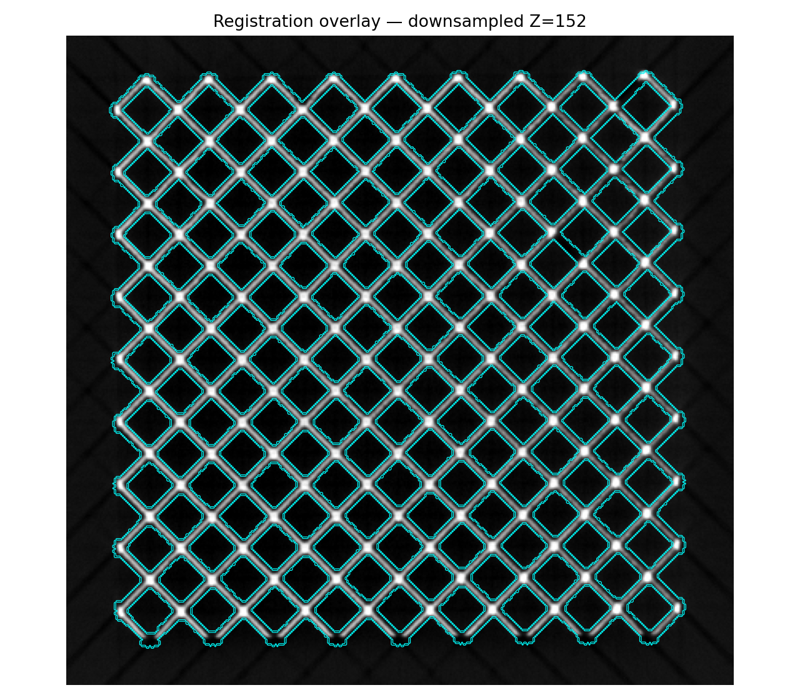
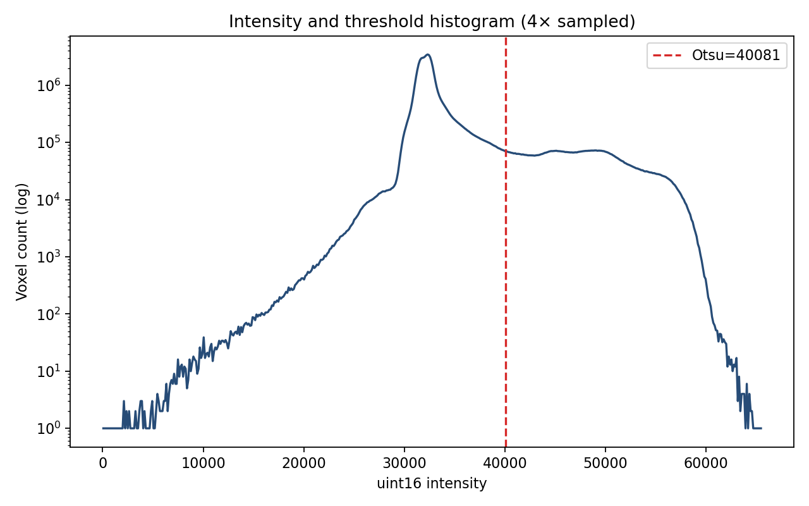
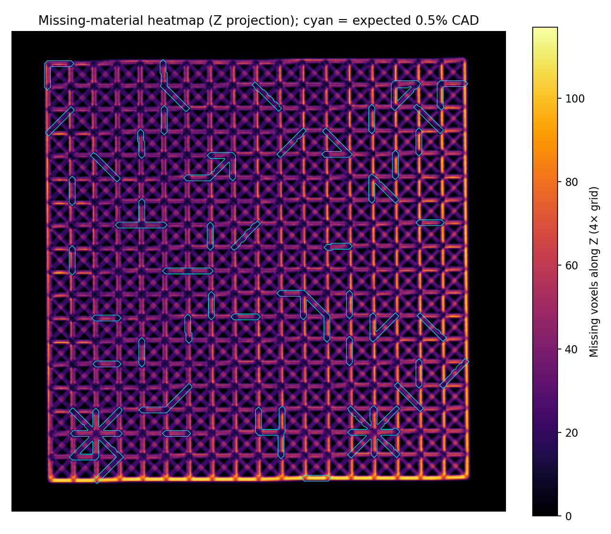

# Stage 2a Missing-Strut Extraction Report

## Outcome

Processed all 18,468 registered struts in the 0.5-1 CT dataset. The dual-CAD comparison found 92 expected design removals. CT classifications: {"Expected_Missing_But_Material_Present": 5, "Missing_Intentional": 87, "Missing_Unintentional": 331, "Nominal": 18045}.

## Method and memory safety

The full (761, 815, 837) uint16 TIFF remained a read-only `tifffile.memmap`. Edge tubes were sampled at 2× spacing in batches; only a 2× dense intensity copy (124.2 MiB) was allocated for masks and plots. The 0% and 0.5% binary STL surfaces were sampled every fourth facet and queried directly at all graph-edge midpoints. The 92 largest 0.5%-versus-0% surface-clearance increases were mapped by testing cube symmetries and selecting the mapping supported by CT occupancy.

All coordinate lengths and centroids use the required isotropic **58.09 µm/source voxel** scale. Volumes are reported in mm³. The Stage 2b 3×3×3 source-voxel noise floor is 0.005293 mm³.

## Explainability artifacts







## Refinement History

```json
[
  {
    "iteration": 1,
    "stage2b_feedback": "Approved affine candidate-registration rerun; original Stage 2a pipeline and prior outputs preserved.",
    "parameters": {
      "analysis_downsample": 2,
      "mask_downsample": 2,
      "tube_radius_full_resolution_voxels": 6.0,
      "tube_radius_um": 348.54,
      "trim_fraction_each_endpoint": 0.2,
      "longitudinal_stations": 21,
      "empty_station_material_fraction": 0.05,
      "minimum_mask_component_downsampled_voxels": 4,
      "cad_surface_clearance_source_voxels": 2.0,
      "otsu_threshold": 40081.0,
      "missing_occupancy_cutoff": 0.08,
      "expected_cad_supported_occupancy_cutoff": 0.025319395679980553
    }
  }
]
```

## Provenance and limitations

- Stage 1 directives were read from `stage_1_literature_review_output/literature_review_output.json`; confidence: High.
- Both `0.stl` and `0.5.stl` were directly queried (3,514,642 and 3,498,656 facets respectively).
- Registration graph positions are XYZ source-voxel coordinates; TIFF indexing is ZYX.
- `sphericity` is an explainable cylinder-equivalent estimate for the sampled missing region, not a full-resolution marching-cubes measurement.
- Bent/inflated labels are screening flags from core-tube evidence; this run prioritizes significant CAD-minus-CT missing material as directed.
