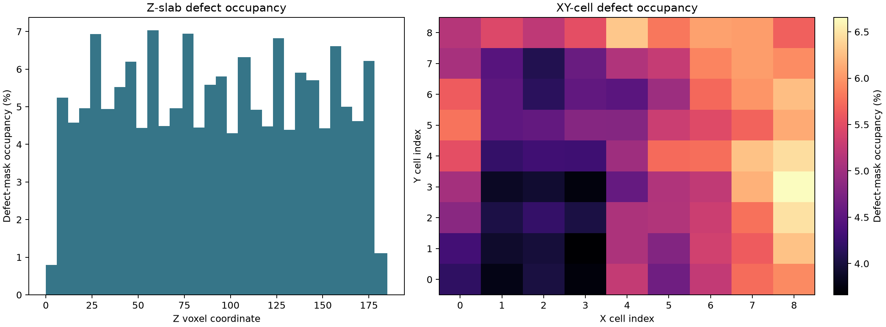
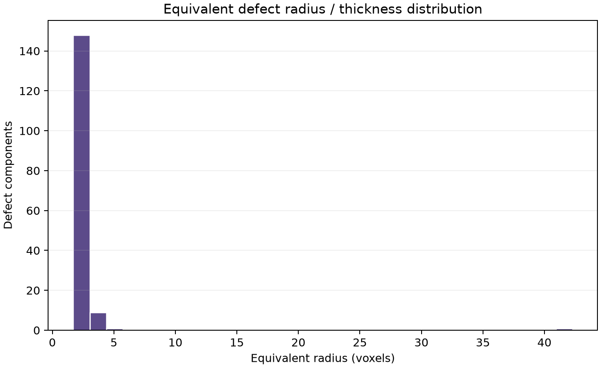
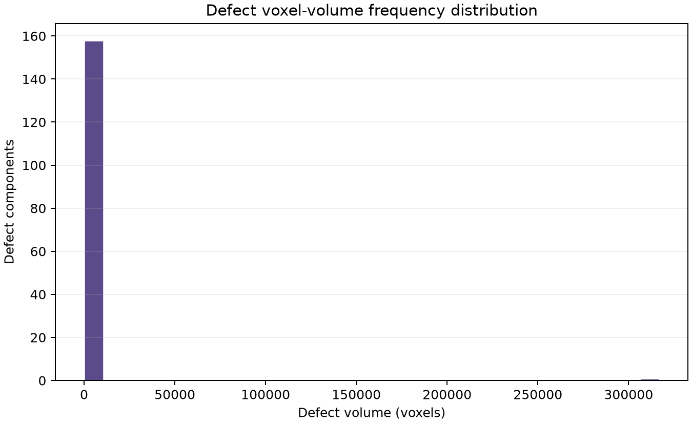

# Stage 3 Post-analysis Defect Report

## Scope and interpretation

This report summarizes Stage 2a candidate defect components. TIFF arrays use `(Z, Y, X)` order. Spatial-density values are **defect-mask occupancy fractions**; without a calibrated material/strut mask they should not be interpreted as physical strut volume fractions.

## Global metrics

- Mask volume: `6,400,260` voxels (`(185, 186, 186)` in Z, Y, X).
- Candidate void voxels: `326,940`; global defect-mask void fraction: `5.1082%`.
- Missing-strut/candidate-defect component count (CSV): `159`.
- Connected components measured directly from the binary mask: `100,878`.
- Median equivalent defect radius: `2.32` voxels.

## Spatial density and distributions

The highest Z-slab occupancy is slab 10/30 at `7.0292%`. The highest 9x9 XY-cell occupancy is cell `(Y=3, X=8)` at `6.6577%`.

## Top severe anomalies

The five largest components account for `97.27%` of all CSV-listed defect voxels. Severity is ranked by voxel count.

| Rank | Component | Voxels | Eq. diameter (vox) | Centroid X | Centroid Y | Centroid Z | BBox X | BBox Y | BBox Z |
| --- | --- | --- | --- | --- | --- | --- | --- | --- | --- |
| 1 | 2 | 316,960 | 84.59 | 111.29 | 104.90 | 96.93 | 184 | 185 | 180 |
| 2 | 125 | 426 | 9.34 | 133.59 | 155.02 | 21.45 | 36 | 46 | 9 |
| 3 | 310 | 235 | 7.66 | 43.56 | 150.51 | 178.22 | 36 | 35 | 8 |
| 4 | 120 | 205 | 7.32 | 108.93 | 106.65 | 21.54 | 25 | 26 | 9 |
| 5 | 124 | 199 | 7.24 | 118.48 | 145.58 | 21.38 | 26 | 26 | 9 |

Per-anomaly extent charts:

- [Rank 1 extent chart](top_anomalies/rank_01_component_2_extent.png)
- [Rank 2 extent chart](top_anomalies/rank_02_component_125_extent.png)
- [Rank 3 extent chart](top_anomalies/rank_03_component_310_extent.png)
- [Rank 4 extent chart](top_anomalies/rank_04_component_120_extent.png)
- [Rank 5 extent chart](top_anomalies/rank_05_component_124_extent.png)
