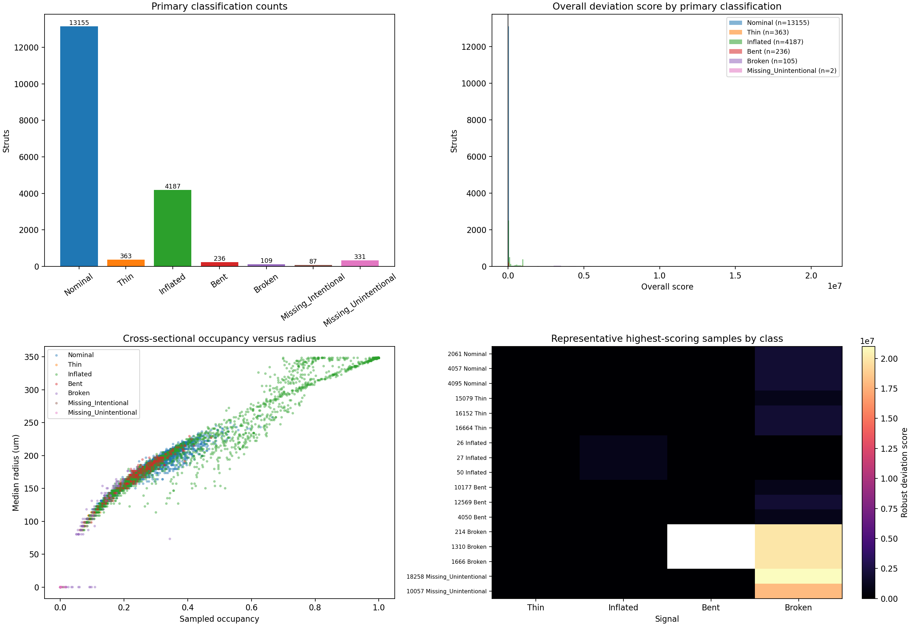

# Stage 3 Defect Analysis Summary

Generated: `2026-07-27T19:30:50.907876+00:00`  
Processed struts: **18,468**  

## Executive summary

This report summarizes the Stage 3 cross-sectional screening run. Stage 2a missing-material classifications are preserved as authoritative labels; the additional Thin, Inflated, Bent, and Broken labels are screening calls calibrated against robust nominal behavior.

- Nominal: **13,155** (71.2%)
- Screening defect labels: **4,895** primary classifications
- Stage 2 missing labels retained: **418**
- Rows needing review: **1,952** (10.6%)

## Inputs and run configuration

- Scan: `/home/hannahdc/llnl_data_science_challenge_2026/part2/data/missing_struts/tif_stacks/210127_Brian_Tran_strut_lattices_0point5dash1 1 Slices.tif`
- Registration graph: `/home/hannahdc/llnl_data_science_challenge_2026/part2/registration/alignment_check/candidate_affine_registered.json`
- Stage 2a inventory: `/home/hannahdc/llnl_data_science_challenge_2026/part2/registration/alignment_check/stage2a_candidate_registration_output/all_struts_inventory.csv`
- Scan shape and dtype: `[761, 815, 837]`, `>u2`

| Parameter | Value |
|---|---:|
| `threshold` | `40081.0` |
| `voxel_size_um` | `58.09` |
| `nominal_radius_voxels` | `6.0` |
| `outer_radius_factor` | `1.5` |
| `trim_fraction` | `0.2` |
| `stations` | `21` |
| `empty_station_fraction` | `0.05` |
| `batch_size` | `96` |
| `score_threshold` | `3.0` |

## Primary classifications

| Classification | Count | Fraction |
|---|---:|---:|
| Nominal | 13,155 | 71.23% |
| Thin | 363 | 1.97% |
| Inflated | 4,187 | 22.67% |
| Bent | 236 | 1.28% |
| Broken | 109 | 0.59% |
| Missing_Intentional | 87 | 0.47% |
| Missing_Unintentional | 331 | 1.79% |

## Feature and score summaries

The table below reports median and 10th/90th percentile values across all processed struts. Scores are non-negative robust deviations; values at or above the configured threshold are candidates for that signal.

| Metric | Median | P10 | P90 |
|---|---:|---:|---:|
| Overall score | 0 | 0 | 7.857e+04 |
| Sampled occupancy | 0.2128 | 0.1323 | 0.3609 |
| Median radius (um) | 160.6 | 126.9 | 204.7 |
| Outside nominal fraction | 0 | 0 | 0.05714 |
| Max centerline offset (um) | 137.4 | 64.95 | 236.2 |
| Bend curvature (um) | 52.67 | 35.49 | 81.98 |

## Representative defect samples

The visualization selects up to three highest overall-deviation struts per primary classification. These are prioritization examples, not ground-truth exemplars; inspect them in the source volume before making a quality decision.

| Strut ID | Primary class | Overall | Thin | Inflated | Bent | Broken | Review |
|---:|---|---:|---:|---:|---:|---:|:---:|
| 2061 | Nominal | 1999997.00 | 0.87 | 0.00 | 0.87 | 2000000.00 | no |
| 4057 | Nominal | 1999997.00 | 1.71 | 0.00 | 0.31 | 2000000.00 | no |
| 4095 | Nominal | 1999997.00 | 1.87 | 0.00 | 0.43 | 2000000.00 | no |
| 15079 | Thin | 999997.00 | 4.18 | 0.00 | 1.81 | 1000000.00 | no |
| 16152 | Thin | 1999997.00 | 4.18 | 0.00 | 1.76 | 2000000.00 | no |
| 16664 | Thin | 1999997.00 | 4.18 | 0.00 | 1.27 | 2000000.00 | no |
| 26 | Inflated | 999997.00 | 0.00 | 1000000.00 | 0.00 | 0.00 | no |
| 27 | Inflated | 999997.00 | 0.00 | 1000000.00 | 0.00 | 0.00 | no |
| 50 | Inflated | 999997.00 | 0.00 | 1000000.00 | 0.00 | 0.00 | no |
| 10177 | Bent | 999997.00 | 1.87 | 0.00 | 20.06 | 1000000.00 | no |
| 12569 | Bent | 1999997.00 | 0.48 | 0.00 | 19.42 | 2000000.00 | no |
| 4050 | Bent | 999997.00 | 1.71 | 0.00 | 17.58 | 1000000.00 | no |
| 214 | Broken | nan | 7.74 | 0.00 | nan | 20000000.00 | yes |
| 1310 | Broken | nan | 7.74 | 0.00 | nan | 20000000.00 | yes |
| 1666 | Broken | nan | 7.74 | 0.00 | nan | 20000000.00 | yes |
| 18258 | Missing_Unintentional | 20999996.00 | 7.74 | 0.00 | 4.22 | 21000000.00 | no |
| 10057 | Missing_Unintentional | 17999996.00 | 7.74 | 0.00 | 3.08 | 18000000.00 | no |

The figure includes class counts, overall-score distributions, occupancy/radius scatter, and a score heatmap for representative samples ranked by their primary signal.

## Interpretation and limitations

- These are screening labels, not validated ground-truth defect annotations.
- Stage 2a Missing_Intentional and Missing_Unintentional labels are preserved and are not reclassified from TIFF evidence.
- Inflated material is measured as an outer-annulus proxy; attachedness and dross identity require local connected-component analysis.
- A registration error can resemble bending or centerline offset.
- Representative samples should be reviewed against the source TIFF and registration before downstream decisions.
